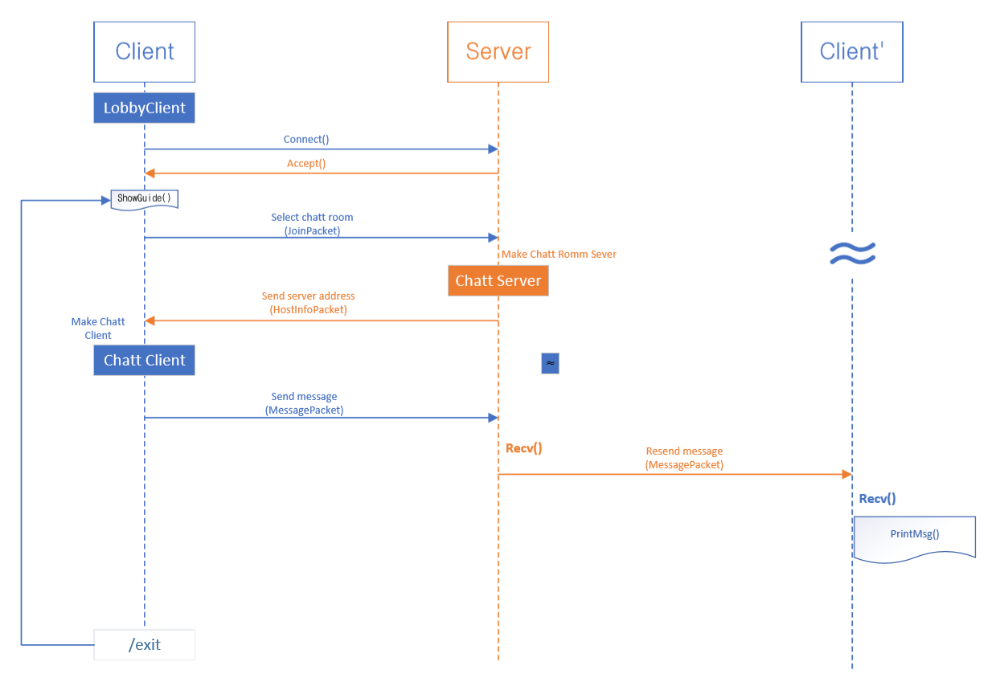
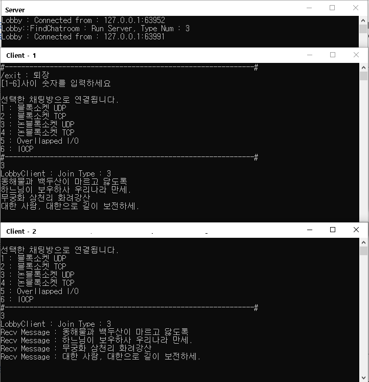
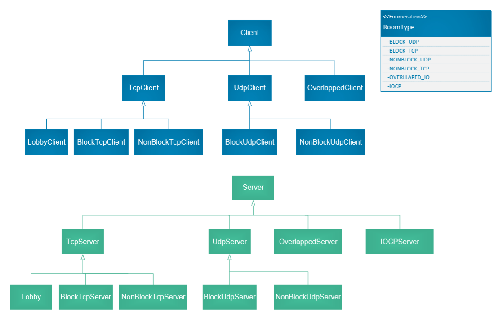
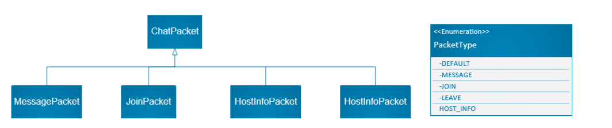

# 프로젝트명 : ChattyTalker
## 개요
>소켓 프로그래밍의 다양한 방식을 사용해 채팅 서버와 클라이언트를 구현한다.
## 채팅방 방식 목록
     1. 블록소켓 UDP
     2. 블록소켓 TCP
     3. 논블록소켓 UDP
     4. 논블록소켓 TCP
     5. Overllapped I/O
     6. IOCP
## 주요 순서도
로비에 접속해 채팅방을 선택하고 채팅에 참여한다.



## 스크린샷


## 클래스 구조
 **Client** , **Server** : TCP/IP 소켓을 사용하는 채팅 클라이언트/서버

 **ChatPacket** : 메세지, 호스트 정보 전달 등을 위해 페킷을 형식화


## 시행 착오
* **문제** : 수신완료 이벤트들의 완료를 기다리는 중에 새로 추간된 수신 이벤트를 대기 이벤트열에 추가하고 싶다.
* **해결** : **Alertable Wait** 상태를 바꾸기 위하여 이벤트열중 첫번째 이벤트를 임의로 변화를 나타내는 이벤트로 설정하여 새 연결이 만들어 지는 경우 이벤트에 신호를 줘 이벤트가 추가됨을 알렸다.

**OverlappedServ::Run()** 함수 일부
``` c++
accp_sock = accept(serv_sock_, (SOCKADDR*)& clnt_addr, &addrlen);

...

WSASetEvent(num_changed_event_);
```

**OverlappedServ::Chat()** 함수 일부
``` c++
DWORD wait_result = WSAWaitForMultipleEvents(sock_num_, events_, FALSE, WSA_INFINITE, true);
		
int index = wait_result - WSA_WAIT_EVENT_0;

if (index == 0)
{
    WSAResetEvent(num_changed_event_);
    continue;
}
```

## 개발 환경
* 언어 : C++
* 편집기 : Visual Studio Commnity 2019
* 링커 추가종속성 : ws2_32.lib (Winsock)
* 프로젝트
  * 콘솔 앱 : [Client](./Client/), [Server](./Server/)
  * 참조(공용) 프로젝트: [Common](./Common/)

